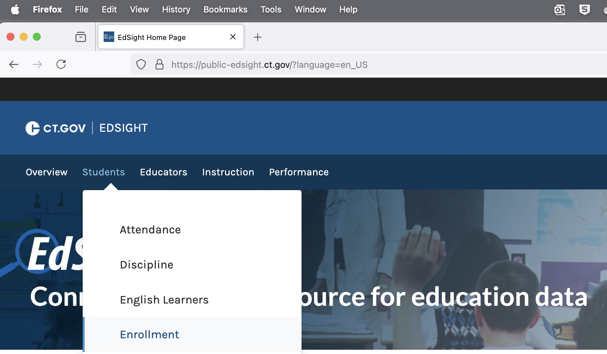
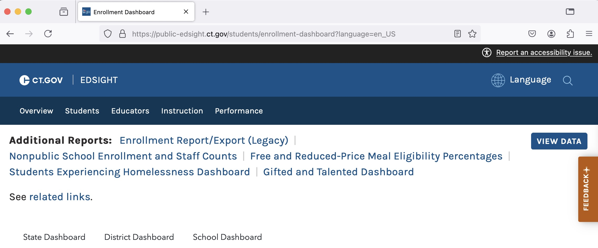
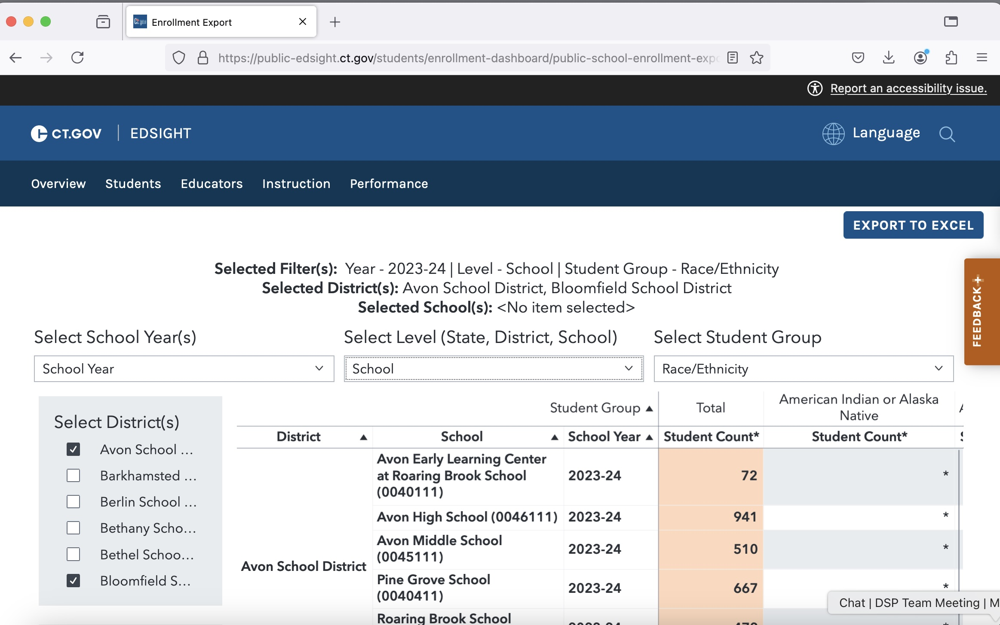
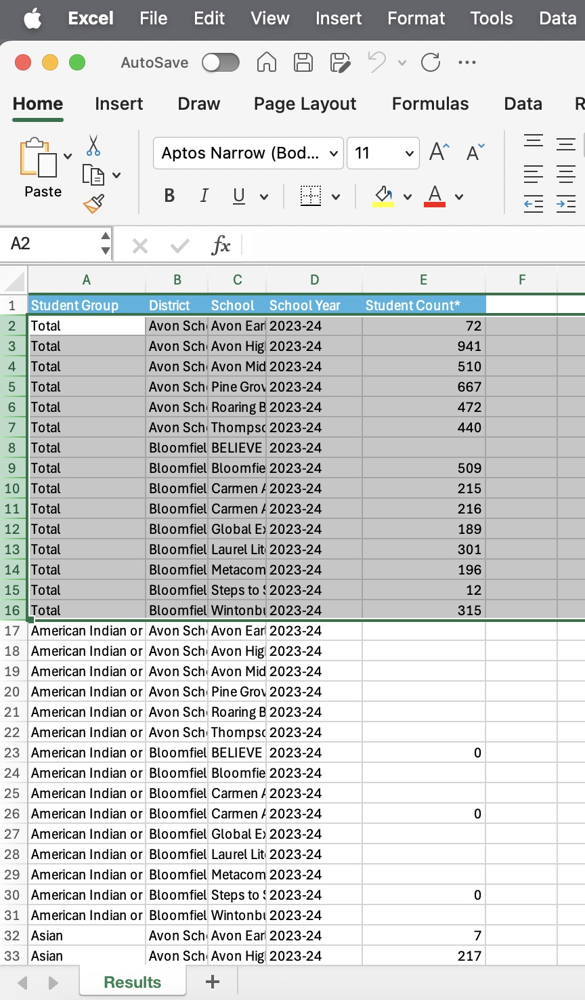
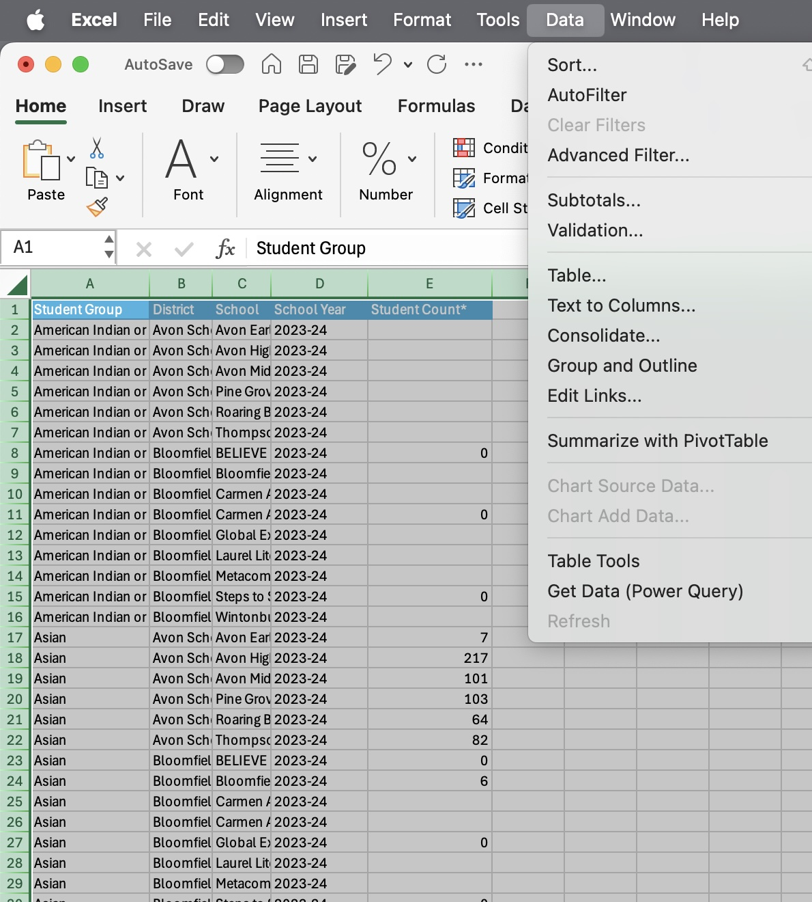
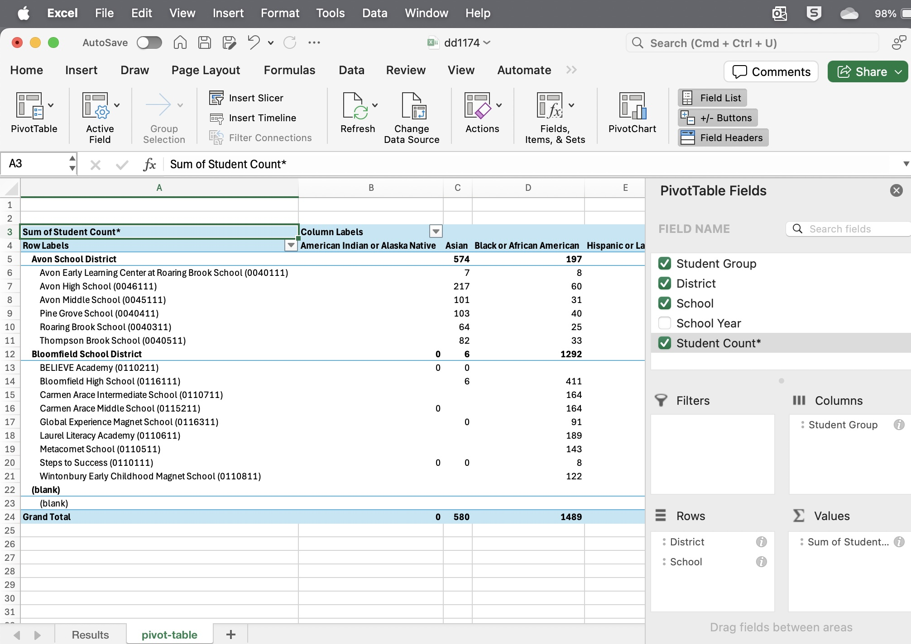
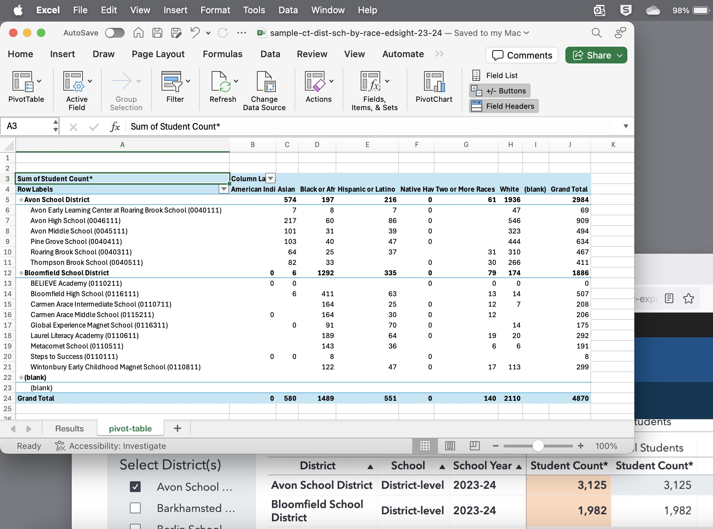

# ct-edsight-tutorial
quick visual tutorial for general audiences to download student enrollment data by district-school from CT Dept of Education, EdSight platform

## Use Case
- General web user to download student enrollment data, at district-school level, by demographic category (such as race-ethnicity), from CT Dept of Education EdSight public platform <https://public-edsight.ct.gov/>
- See alternative method for advanced users in CT Data Collaborative repo (Python code) <https://github.com/CT-Data-Collaborative/student-enrollment-by-race-ethnicity>

1. Open [EdSight](https://public-edsight.ct.gov/) with a browser that displays the horizontal menu items, such as Firefox (not Safari). Select Students > Enrollment

2. The next screen displays the Enrollment Report. Click `View Data` button, rather than the visualization tool.

3. In the data screen, select School Year (default is most recent), Level (such as School), and Student Group demographics (such as Race/Ethnicity). Also select District checkboxes. The preview of data is limited on this screen. Click the `Export to Excel` button.

4. Open the downloaded result file with Excel or other spreadsheet tool. The raw data is displayed in long columns. Recommended: Delete the `Total` rows to avoid double-counting data in next steps.    

5. In Excel or a similar spreadsheet tool, select the entire sheet and create a Pivot Table to summarize the data an make it easier to view and analyze.

6. Edit the Pivot Table to display District and School in Rows, Student Group (demographic variable) in Columns, and Sum of Student Count* in Values. The Pivot Table displays subtotals for each District, School, and Student Group, and Grand Totals in the last Column and bottom Row.

7. Note that `Student Count*` contains some suppressed data, where cell size is smaller than 5 students, to protect individual privacy per CT Dept of Ed policy. As a result, the Grand Totals in the pivot table are likely to be smaller than the School or District aggregated totals displayed on the EdSight platform.

8. [Download sample Excel file with pivot table](sample-ct-dist-sch-by-race-edsight-23-24.xlsx) 
